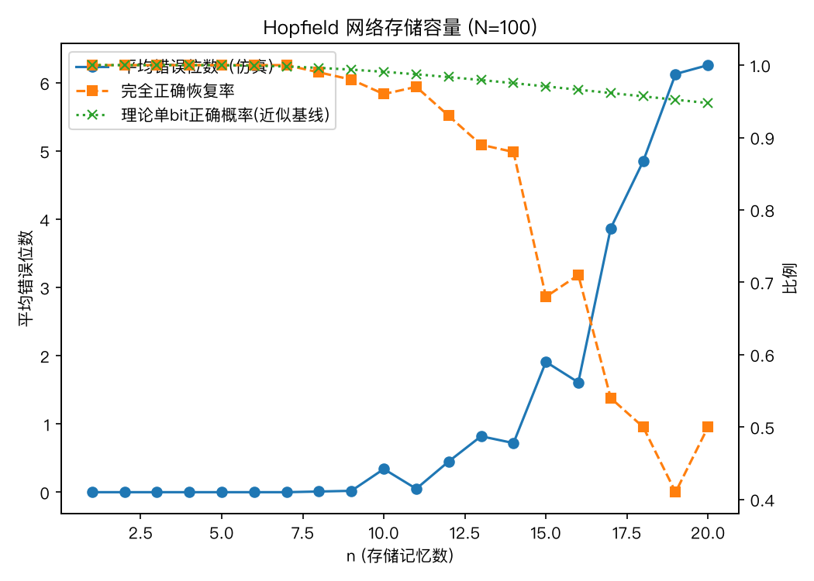

# nn-labs

Small, from-scratch reproductions of neural network papers and mechanisms — no framework magic, just NumPy and the original equations.

## Contents

### [`hopfield-1982/`](./hopfield-1982)

Reproduces the computational studies from Hopfield's 1982 PNAS paper *"Neural networks and physical systems with emergent collective computational abilities"*.

- 9 explicitly reported simulation experiments, in paper order
- 3 executable mechanism extensions clearly separated from the reported experiments
- Reusable `a/b/c/d/e/f` components for memories, weights, initial states, dynamics, measurements, and plots
- Lightweight runs by default: trajectories and energy histories are recorded only when requested

Run the structured, annotated notebook in Colab:

The notebook is self-contained: shared components live in its first collapsible section and every paper experiment is a short, visible composition such as `a1 → b1 → c3 → d1 → e1 → f1`. Each section includes the original paper location, experiment question, component recipe, result, and comparison with the paper.

Choose **Runtime → Restart session and run all** in Colab. No local Python environment or companion `.py` module is required.

The original capacity result remains as a quick preview:

Recall degrades sharply around `n ≈ 15` (i.e. `n ≈ 0.15N`), consistent with the paper's reported capacity of `~0.15N` (later refined to the precise `~0.138N` by Amit, Gutfreund & Sompolinsky, 1985, via the replica method).
